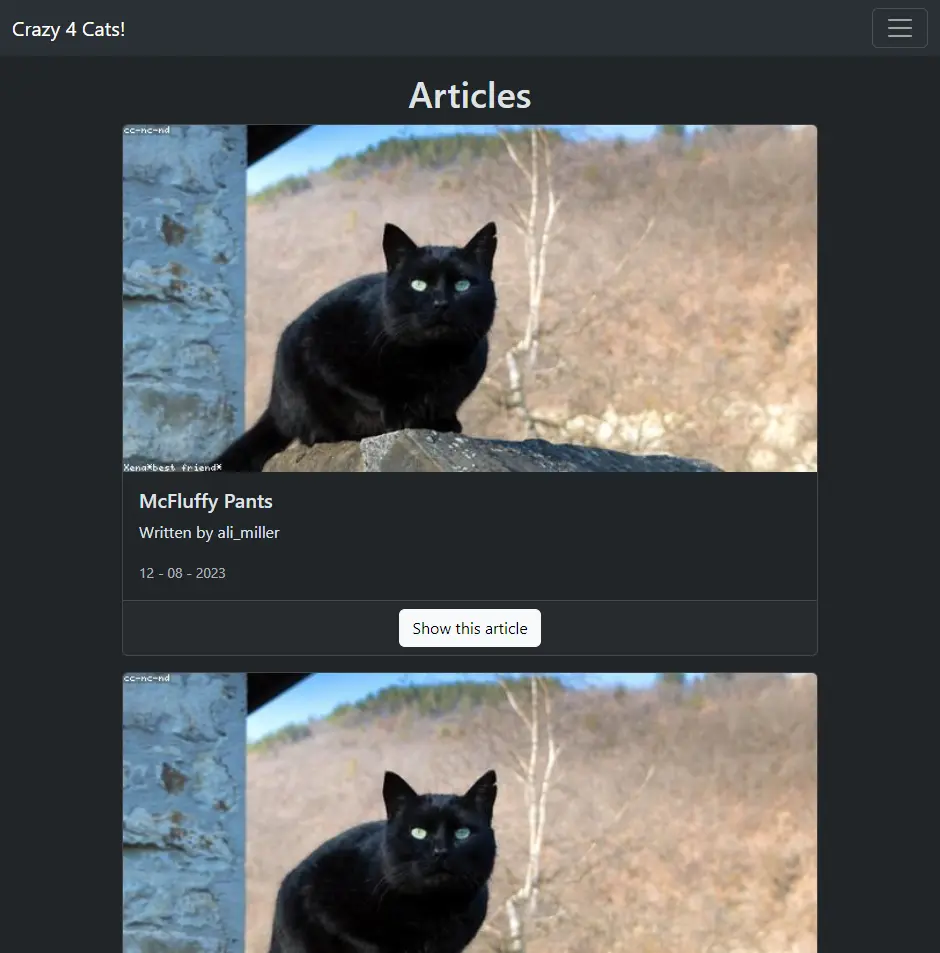
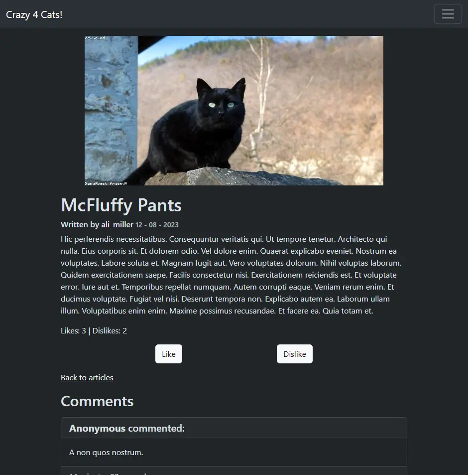
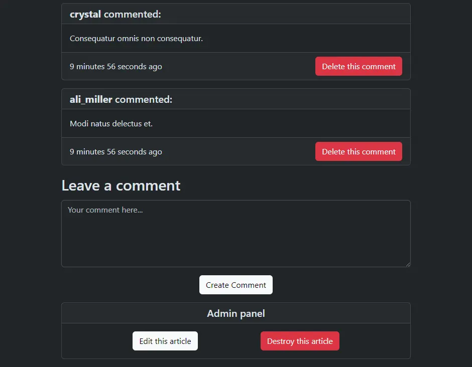
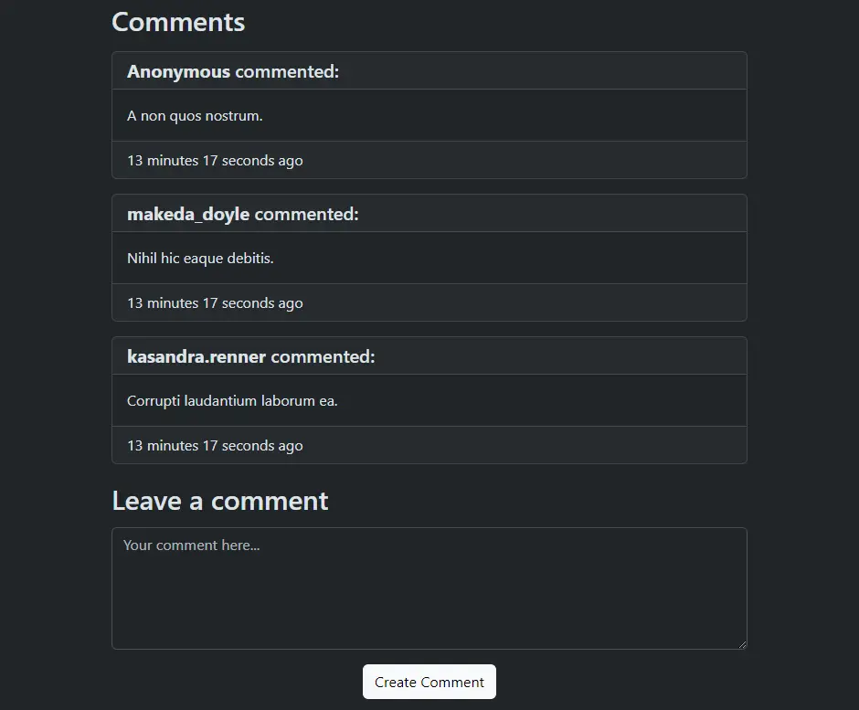
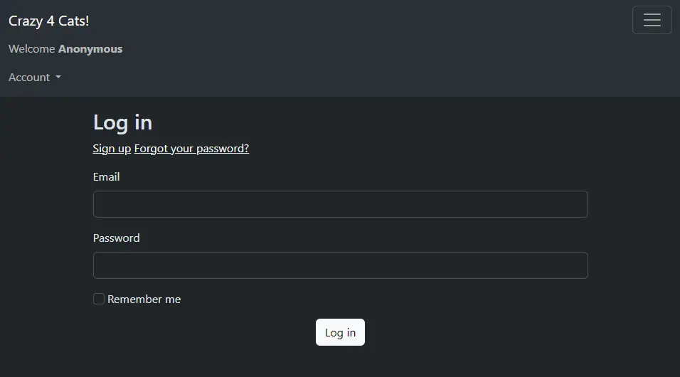
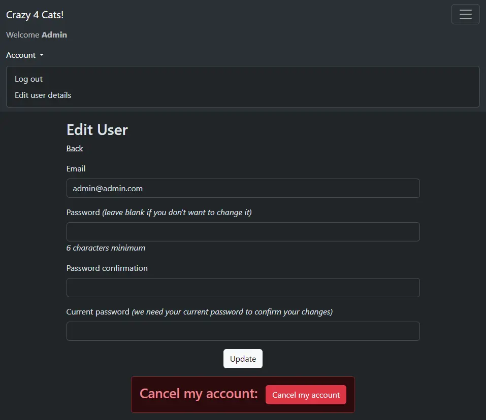

# Crazy 4 Cats!

Blog web app for a cat lover who wants to share his cat adventures with the world, built with Ruby on Rails.

## Description

Blog web app with a fully functioning user authentication system set up using Devise. There are 2 roles available: **User**, who can create articles and comments and **Admin**, who can also edit and delete them. Guests can view articles and leave anonymous comments in them. All registered users can also like or dislike the articles (or remove their reaction if they chose to).

## Views

### Index


### Article


### Admin permissions


### Comments


### Log in


### Edit user


Placeholder images from [LoremFlickr](https://loremflickr.com/) 🐱

## Deploy on Heroku via CLI

* Log in using ```heroku login```
* Create app using ```heroku create```
* Connect to app using ```heroku git:remote -a app_name```
* Upload app using ```git push heroku main```
* Run migrations using ```heroku run rails db:migrate```
* Create or update an admin account:
    * Launch a Rails console with ```heroku run rails console```
    * Create an **Admin** account with ```User.create(email:"your@email.com", password:"your_password", username:"your_username", role:"admin")```
    * Or modify an existing account with the following commands
        ```ruby
        admin = User.find(your_user_id)
        admin.role = "admin"
        admin.save
        ```


## Software used

* [Ruby 3.2.2](https://www.ruby-lang.org/en/)  
* [Rails 7.0.6](https://rubyonrails.org/)  
* [PostgreSQL 14.8](https://www.postgresql.org)  
* [Bootstrap 5.3.1](https://getbootstrap.com/)  

### Gems

* [Annotate 3.2.0](https://github.com/ctran/annotate_models)  
* [Devise 4.9.2](https://github.com/heartcombo/devise)  
* [Faker 3.2.1](https://github.com/faker-ruby/faker)

## Possible improvements

* Article search with [PgSearch](https://github.com/Casecommons/pg_search)  
* Pagination with [Pagy](https://github.com/ddnexus/pagy)  
* Role permission tests  
* Mailer setup with the help of [Figaro](https://github.com/laserlemon/figaro) to configure environment variables  
* Icons for reactions
